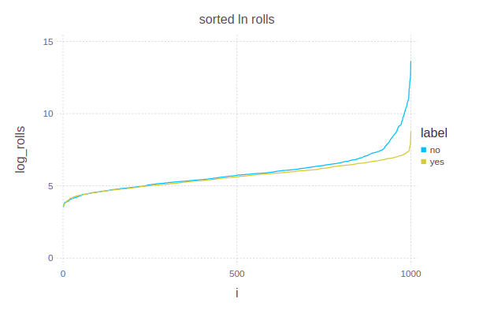
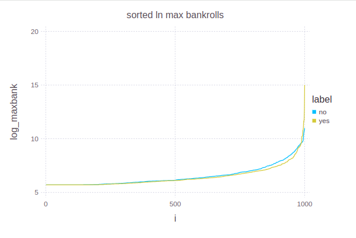
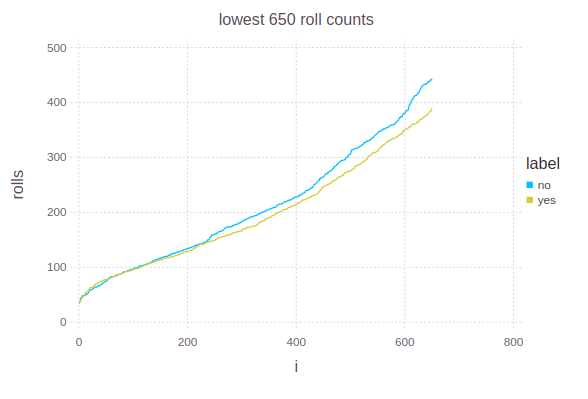
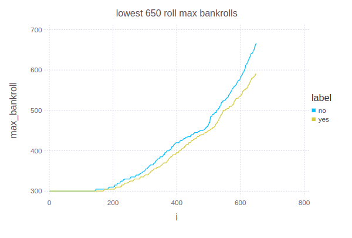

# Craps Simulation

This simulator only knows how to bet with one strategy.
It makes a pass bet or come bet whenever it can,
and it always places odds bets when it can.

The motivation is to see how long play continues
under variations of play and how big the bankroll grows.
Each scenario runs until the player is broke.
Quantiles are printed.

    RUST_LOG=warn cargo run -- --n-trials 1000
    cargo run -- --help

It's a learning tool, so I wasn't avoiding panics
while programming.

## Analysis

Quantiles are nice for overviews of different strategies
in action.

For visualization, there is some Julia code that can be
adapted and pasted into a persistent Julia interpreter session
after running a set of commands along these lines:

    RUST_LOG=warn cargo run -- --csv-output-file grow-bets.csv --min-bet 5 --odds-off-without-point --plot-label no --n-trials 1000 --grow-odds
    RUST_LOG=warn cargo run -- --csv-output-file grow-bets.csv --min-bet 5 --odds-off-without-point --plot-label yes --grow-bets --n-trials 1000 --grow-odds

The Julia code creates plots like the ones below,
which show the effect of growing the bet size along
with the bankroll size.

In this case, there are 1000 runs, so the median is at 500
on the x axis.
The plot of the log of the maximum bankroll shows that
in a few extreme cases, the strategy of increasing the bet size
results in a much greater maximum bankroll.
The plot of the log of the number of rolls before the player
goes broke shows that extremely long play times are more likely
if the bet amount doesn't grow.

By removing the extreme values, the last two plots allow
the logarithms to be avoided, and the common cases become
easier to see near 500 on the x axis, where growing bets
can be seen to reduce play time and reduce the maximum bankroll
as well.

